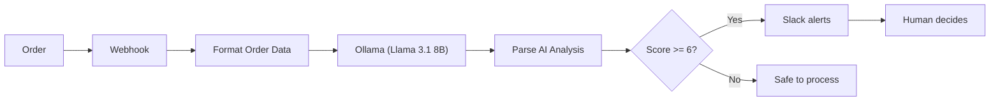

# Architecture

Event-driven pipeline: n8n receives an order, a local LLM scores the risk, and Slack alerts a human when the score is 6 or higher.

```mermaid
flowchart LR
    A["Order"] --> B["Webhook"] --> C["Format Order Data"] --> D["Ollama (Llama 3.1 8B)"] --> E["Parse AI Analysis"] --> F{"Score >= 6?"}
    F -- "Yes" --> G["Slack alerts"] --> H["Human decides"]
    F -- "No" --> I["Safe to process"]
```
